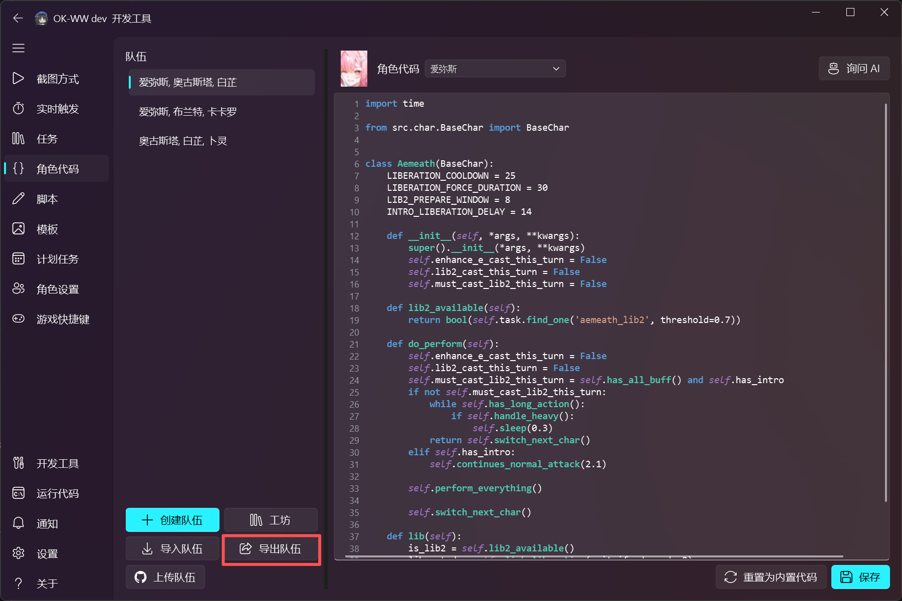
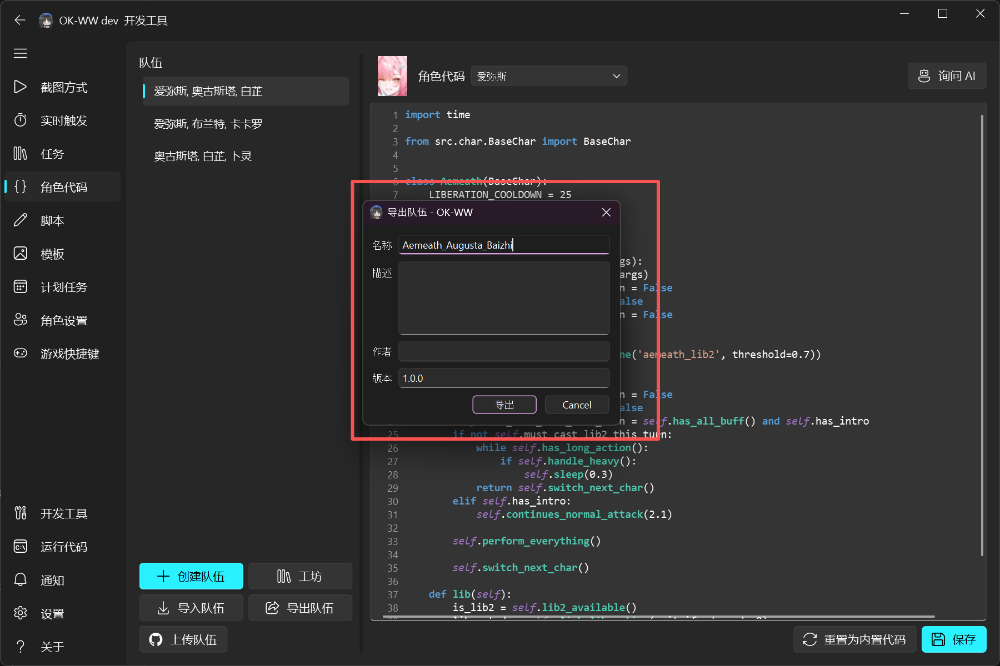
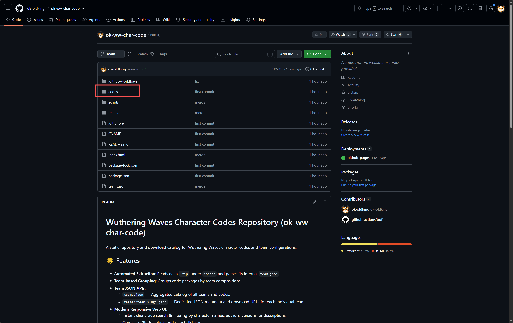
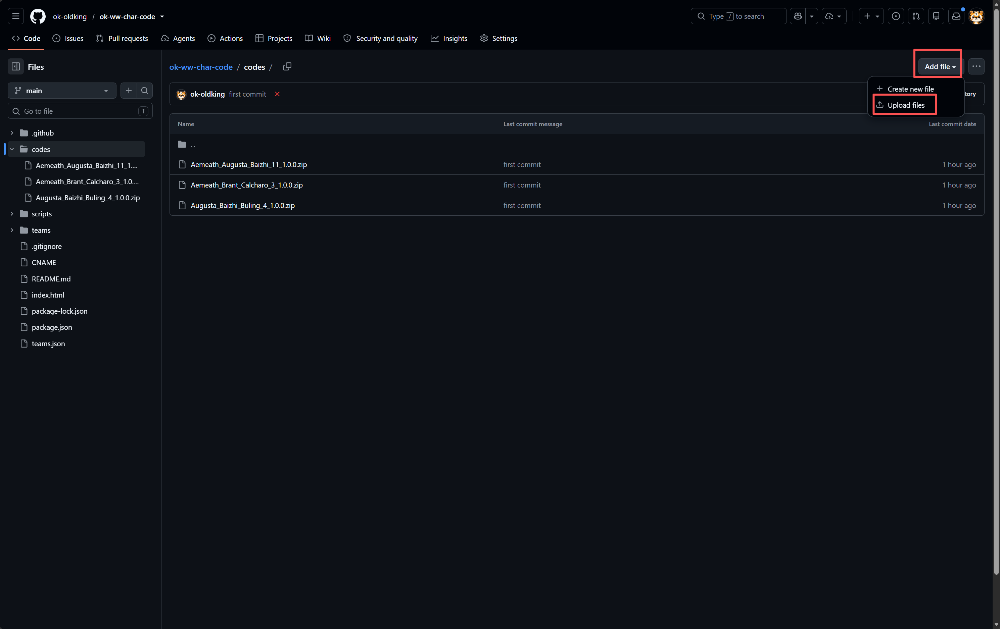
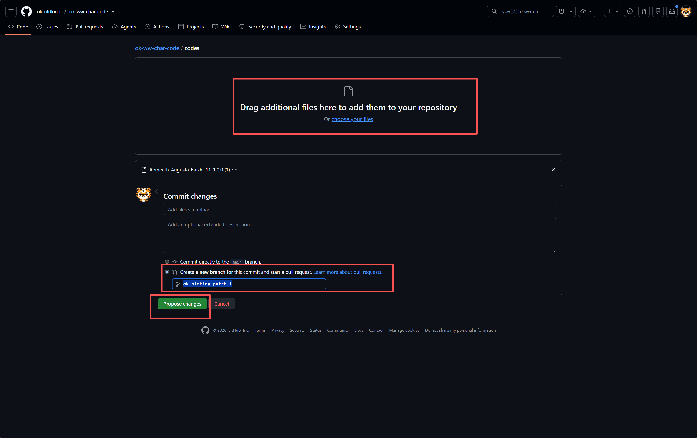

# 鸣潮角色配置代码仓库 (Wuthering Waves Character Codes)

[English Version](#-english-documentation) | [在线浏览与下载平台](https://okwwcharcode.ok-script.com/) | [teams.json 全量接口](https://okwwcharcode.ok-script.com/teams.json)

本项目是《鸣潮》（Wuthering Waves）角色代码与配队脚本配置的静态发布与分发仓库。所有压缩包均按配队自动分组呈现，并提供静态网页浏览、直链下载以及 JSON API 数据接口。

---

## 📖 目录

- [✨ 特性亮点](#-特性亮点)
- [🤝 如何导出与提交队伍配置 (PR 教程)](#-如何导出与提交队伍配置-pr-教程)
  - [第一步：在开发工具中导出队伍压缩包](#第一步在开发工具中导出队伍压缩包)
  - [第二步：在 GitHub 上传并创建 Pull Request (网页端便捷操作)](#第二步在-github-上传并创建-pull-request-网页端便捷操作)
  - [命令行 Git 提交方式 (进阶用户)](#命令行-git-提交方式-进阶用户)
- [📦 压缩包规范与 team.json 说明](#-压缩包规范与-teamjson-说明)
- [🌐 访问与 API 接口](#-访问与-api-接口)
- [💻 本地开发与构建](#-本地开发与构建)
- [🌐 English Documentation](#-english-documentation)

---

## ✨ 特性亮点

- **自动解析与归类**：自动扫描 `codes/` 目录下的 `.zip` 文件并解析其中的 `team.json`，按队伍自动分类。
- **全自动化 CI/CD**：通过 GitHub Actions 自动化构建，合入 PR 后无需人工干预，自动更新静态网页与 JSON 接口。
- **独立 JSON 接口**：除网页外，还为每个配队生成独立的 `teams/<team_name>.json` 及全局 `teams.json`，便于第三方工具调用。
- **确定性构建**：依赖 Git Commit 时间戳作为版本依据，避免不必要的构建冲突。

---

## 🤝 如何导出与提交队伍配置 (PR 教程)

欢迎向本项目提交新的配队配置代码！你可以直接使用 **OK-WW dev 开发工具** 配合 **GitHub 网页端** 快速提交 PR，无需复杂的命令行操作。

### 第一步：在开发工具中导出队伍压缩包

1. 在 **OK-WW dev 开发工具** 中，选择左侧导航栏的 **「角色代码」**。
2. 选中你要分享的队伍（例如：*爱弥斯, 奥古斯塔, 白芷*），点击左下方的 **「导出队伍」** 按钮：

   

3. 在弹出的 **「导出队伍」** 窗口中填写配置信息：
   - **名称**：队伍名称（如 `Aemeath_Augusta_Baizhi`）
   - **描述**：配队手法、轴循环或说明
   - **作者**：你的昵称或社区 ID
   - **版本**：初始建议为 `1.0.0`
4. 填写完毕后点击 **「导出」** 按钮，工具会自动打包并保存为一个标准的 `.zip` 压缩文件。

   

---

### 第二步：在 GitHub 上传并创建 Pull Request (网页端便捷操作)

1. 打开本项目仓库页面，点击进入 **`codes`** 文件夹：

   

2. 在 `codes` 目录下，点击右上角的 **「Add file」** 下拉菜单，选择 **「Upload files」**：

   

3. 上传与提交：
   - 将刚刚导出的 `.zip` 文件拖拽上传至上传区域。
   - 在下方提交区域勾选 **「Create a new branch for this commit and start a pull request」**（为此次提交创建新分支并发起 PR）。
   - 点击绿色按钮 **「Propose changes」**。

   

4. 点击 **「Create pull request」** 确认提交。
5. 待 PR 审核合并到 `main` 分支后，GitHub Actions 会自动部署更新至 [okwwcharcode.ok-script.com](https://okwwcharcode.ok-script.com/)！

---

### 命令行 Git 提交方式 (进阶用户)

如果你习惯使用 Git 命令行：

```bash
# 1. 克隆你 Fork 的仓库
git clone https://github.com/<你的用户名>/ok-ww-char-code.git
cd ok-ww-char-code

# 2. 创建并切换新分支
git checkout -b add-my-team-code

# 3. 将导出的 .zip 文件放入 codes/ 目录
# codes/Aemeath_Augusta_Baizhi_11_1.0.0.zip

# 4. （可选）本地构建验证
npm install
npm run build

# 5. 提交并推送到你的分支
git add codes/
git commit -m "feat: add <队伍名称> character code by <作者>"
git push origin add-my-team-code

# 6. 在 GitHub 页面发起 Pull Request 即可
```

---

## 📦 压缩包规范与 team.json 说明

开发工具导出的 `.zip` 文件根目录下包含 `team.json` 与各角色的 Python 脚本：

```text
Aemeath_Augusta_Baizhi_11_1.0.0.zip
├── team.json        # 队伍元数据配置文件
├── Aemeath.py       # 角色脚本
├── Augusta.py       # 角色脚本
└── Baizhi.py        # 角色脚本
```

`team.json` 数据结构如下：

```json
{
  "name": "Aemeath_Augusta_Baizhi",
  "description": "队伍说明、输出轴循环或使用注意事项",
  "author": "你的昵称或GitHub用户名",
  "version": "1.0.0",
  "team": "Aemeath, Augusta, Baizhi"
}
```

---

## 🌐 访问与 API 接口

| 资源 | 访问地址 | 说明 |
| :--- | :--- | :--- |
| **在线静态展示页** | [okwwcharcode.ok-script.com](https://okwwcharcode.ok-script.com/) | 包含搜索、筛选与下载的前端页面 |
| **全量队伍配置接口** | `https://okwwcharcode.ok-script.com/teams.json` | 包含所有队伍、角色及下载直链汇总 |
| **单队伍配置接口** | `https://okwwcharcode.ok-script.com/teams/<队伍名>.json` | 单个队伍的详细元数据及版本下载列表 |
| **ZIP 文件直链** | `https://okwwcharcode.ok-script.com/codes/<文件名>.zip` | 压缩包直接下载链接 |

---

## 💻 本地开发与构建

```bash
# 安装依赖
npm install

# 生成静态页面、teams.json 与 teams/*.json
npm run build
```

---

<br/>

## 🌐 English Documentation

A static repository and download catalog for Wuthering Waves character codes and team configurations.

### Features
- **Auto Parsing & Grouping**: Automatically parses `team.json` within zip files inside `codes/` and groups them by team.
- **Dedicated Team APIs**: Generates individual `teams/<team_name>.json` APIs and a root aggregated `teams.json`.
- **Automated CI/CD**: Automatically builds and deploys to GitHub Pages (`okwwcharcode.ok-script.com`) on PR merges.
- **Deterministic Builds**: Uses Git commit timestamps to ensure idempotent builds and prevent merge conflicts.

---

### How to Export and Submit a PR (Step-by-Step)

#### Step 1: Export Zip from OK-WW dev tool
1. Open the **OK-WW dev** developer tool, select **Character Code (角色代码)** on the left menu.
2. Select your team and click the **Export Team (导出队伍)** button:

   

3. Fill in the team name, description, author, and version, then click **Export (导出)**:

   

---

#### Step 2: Upload to GitHub & Open PR (Web UI)
1. Go to this GitHub repository and navigate into the **`codes`** directory:

   

2. Click **Add file** -> **Upload files**:

   

3. Drag & drop your exported `.zip` file into the upload area.
4. Select **"Create a new branch for this commit and start a pull request"** and click **Propose changes**:

   

5. Click **Create pull request** to submit. Once merged, GitHub Actions will automatically rebuild and deploy to [okwwcharcode.ok-script.com](https://okwwcharcode.ok-script.com/).

---

### API Endpoints

- **Web Portal**: [https://okwwcharcode.ok-script.com/](https://okwwcharcode.ok-script.com/)
- **All Teams Index**: `https://okwwcharcode.ok-script.com/teams.json`
- **Individual Team API**: `https://okwwcharcode.ok-script.com/teams/<team_slug>.json`
- **Direct ZIP Download**: `https://okwwcharcode.ok-script.com/codes/<filename>.zip`
